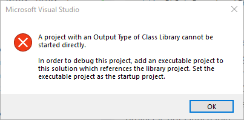
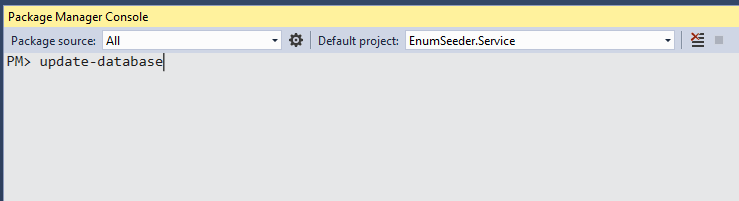
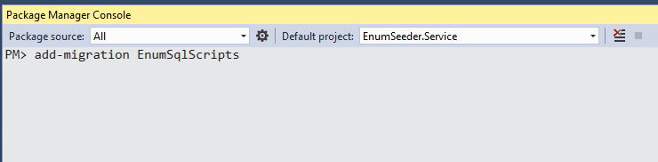

# EnumSeeder
Code first may be the best thing since sliced bread, but 
I don't care much for how it handles enums. 
Enums work just fine but if you're only looking at the 
database they don't make much sense. 

So an enum like the following:

```csharp
public enum Status {
    New,
    InProgress,
    OnHold
}
```

becomes 0, 1, and 2 in the database. 
Functionally this is fine, but you'll find yourself 
constantly refrencing the enum code to figure out what 
a status of 2 means in the "jobs" table.

In a more traditonal (old style) database we would have 
had a lookup table called Department with Id and Name columns. 
This table could easily be joined to the jobs table 
so we could displaye the human readable names of 
"New", "InProgress", and "OnHold" instead of 0, 1 and 2.

You could manually create and populate the table using a 
custom migration and some insert statements, but now if the 
enum needs to change you will likely have more than one place 
to change the code.

Fortunately with just a little bit of code you can create 
something that is a lot more "code-first-like" where all you
need to do is change the enum and everything else will
just fall in line.

So let's walk through it.
I have 3 projects in my example, a Web API project, a models 
project and a service project.
You can use this technique regardless of how you layout your own 
projects. This is just my standard configuration. 
I have also added swagger to my configuration to make 
it easy to test.

We'll start by creating a model and an enum in the models project.
We'll create a class called "Employee" (with an interface of IEmployee) that 
uses an enum called "Department".

```csharp
public enum Department{

    [Description("Sales")]
    Sales = 1,

    [Description("Customer Service")]
    CustomerService = 2,

    [Description("Technical Support")]
    TechnicalSupport = 3
}

public class Employee : IEmployee
{
    [Key]
    [DatabaseGenerated(DatabaseGeneratedOption.Identity)]
    [Display(Name = "Id")]
    public int Id { get; set; }

    [StringLength(512, ErrorMessage = "The first name cannot be longer than 512 characters")]
    [Display(Name = "First Name")]
    [Required]
    public string FirstName { get; set; }

    [StringLength(512, ErrorMessage = "The last name cannot be longer than 512 characters")]
    [Display(Name = "Last Name")]
    [Required]
    public string LastName { get; set; }

    public Department Department { get; set; }

}
```

You should note that we are using a description attribute and
we are explicitly setting a value for each enum.
This is important because these values will become the 
IDs in the lookup table.

Next, in the models project we'll add a base class for all of the enums to inhereit from:

```csharp
public class EnumBase<TEnum> where TEnum : struct
{
    [Key]
    [DatabaseGenerated(DatabaseGeneratedOption.None)]
    public virtual int Id { get; set; }

    [Required]
    [MaxLength(100)]
    public virtual string Name { get; set; }

    [MaxLength(100)]
    public virtual string Description { get; set; }
}
```

Finally, we'll add a class that will represent the enum 
and have it inherit from our "EnumBase" class.

```csharp
[Table("Department")]
public class DepartmentEnum : EnumBase<Department>
{
    public DepartmentEnum()
    {
    }
}
```

I have added the "Table" attribute to this class because 
the name `Department` makes more sense than a table 
called `DepartmentEnum`.

Now we need to add some code to bring it all together.
In my service project I add a helper class to do 
all of the work extracting and processing the enum.

```csharp
public class EnumHelper
{
    public static void SeedEnumData<TData, TEnum>(DbSet<TData> items, ApplicationDbContext context)
        where TData : EnumBase<TEnum>
        where TEnum : struct
    {
        var primaryEnumType = typeof(TEnum);

        if (!primaryEnumType.IsEnum)
            throw new Exception(string.Format("The type '{0}' must be of type enum", primaryEnumType.AssemblyQualifiedName));

        var enumType = Enum.GetUnderlyingType(primaryEnumType);

        if (enumType == typeof(long) || enumType == typeof(ulong) || enumType == typeof(uint))
            throw new Exception();

        foreach (TEnum enumValue in Enum.GetValues(primaryEnumType))
        {
            var enumItem = Activator.CreateInstance<TData>();

            enumItem.Id = (int)Convert.ChangeType(enumValue, typeof(int));

            if (enumItem.Id < 1)
                throw new Exception("Enum value must be positive number greater than zero. You may need to set an explicit enum value");

            enumItem.Name = Enum.GetName(primaryEnumType, enumValue);

            enumItem.Description = GetEnumDescription(enumValue);

            //get a list of existing IDs
            List<int> existingItemIds = context.Set<TData>().Select(x => x.Id).ToList();
            if (!existingItemIds.Contains(enumItem.Id))
            {
                items.Add(enumItem);
            }
        }
    }

    public static string GetEnumDescription<TEnum>(TEnum enumItem)
    {
        Type type = enumItem.GetType();

        var attribute = type.GetField(enumItem.ToString()).GetCustomAttributes(typeof(DescriptionAttribute), false).Cast<DescriptionAttribute>().FirstOrDefault();
        return attribute == null ? string.Empty : attribute.Description;
    }
}
```

Now we can add our DbSets to our DbContext and prepare to
create the database.

```csharp

public DbSet<Employee> Employees { get; set; }

public DbSet<DepartmentEnum> Departments { get; set; }

```

Because we have split our services into it's own project 
we'll also need a DbContextFactory. An IDesignTimeDbContextFactory
class is necessary to get all of the migration commands
to work with a class. In a default web api setup your
models and DbContext would all be part of the same project.
That project can be launched and can contain its own 
connection string. The service class, however, can't
be launched and can't have its own connection string.
You may have seen this error before when you accidentally
set a class file to launch.



The IDesignTimeDbContextFactory is our work-around
for this problem and the ideal place to put our
new seeding methods. I added a class called DbContextFactory.
It inherits from IDesignTimeDbContextFactory

```csharp
public ApplicationDbContext CreateDbContext(string[] args)
{

    var builder = new DbContextOptionsBuilder<ApplicationDbContext>();
    builder.UseSqlServer(
        @"Server=(localdb)\MSSQLLocalDB;Database=EnumSeeder;Trusted_Connection=True;MultipleActiveResultSets=true");

    //get the dbContext
    var context = new ApplicationDbContext(builder.Options);

    //uncomment this line if you need to debug this code
    //then choose yes and create a new instance of visual
    //studio to step through the code
    //Debugger.Launch();

    //add in our enum data
    EnumHelper.SeedEnumData<DepartmentEnum, Department>(context.Departments, context);

    //save all of the enum changes
    context.SaveChanges();

    return context;
}
```

The important line is:

```csharp     
//add in our enum
EnumHelper.SeedEnumData<DepartmentEnum, Department>(context.Departments, context);
```
 Which comes in the form of:

```csharp
EnumHelper.SeedEnumData<ENUM_CLASS_NAME, ENUM>(context.ENUM, DBCONTEXT);
```
We will need one of these lines for each enum we add to 
the project. Once this line is added however, it should never
be necessary to do anything but just change the actual enum
code.

At this point all we need to do is switch to the 
service project in the package manager console and set 
the service project as the startup project. 
Now we can add our initial migration.


Next we'll call "update-database" twice.



The second call is necessary because the first time through
it won't have created the new "Department" table.
The second run will say it did nothing but it will populate
the table with the values from the enum. 

At this point we have the new Department table created and
its polulated with the data from the enum.
Now we can move on to the final problem: How do we get
this data into our migrations script.

**Script-Migration**  
One of the big advanteges of code first is that you can 
generate a SQL script that can be used to update your
actual database (staging, qa, production etc.). We
do this by using the `script-migration` command.
This script performs a check ahains the __EfMigrationsHistory
table to determine if a migration needs to be applied.
It's also pretty easy to flatten the migrations back out
if you find yourself with too many. 
Unfortunately none of the data that we just added will ever
make it's way to anything but our local database.
You could change your connection string and run 
the `update-database` against another server, but I prefer
to have all of my chnages scripted out. It makes it easy
for any DBA to review and also makes it easy to hand
off the responsibility for these changes.





There are a few gotchas to this approach: 

- Runnning update-database twice when there is a new enum 
is a bit goofy. Might be fixable if you can get the create table process to somehow 
happen before the code that inserts the data.

- Checking to see if the database/table exists by 
using an exception is slow. Also may be fixed with a 
little more research in how to do `if database exists` 
and `if table exists` using something besides an exception.
DbConext does provide a method for checking if the database 
exists, but not a table (in a generic way) as far as I 
can see. I stuck with the exception because it seemed to 
be more universal despite being a bit slow.


I do love code first and it solves one of the biggest biz-dev 
headaches, namely keeping databases in sync between developers. 
But it also somewhat promotes the idea that you have to know 
much about the database or how it works. It is getting better,
and many of the old school
I do think that may be an acheiveable goal someday, but in 
the meantime

Finally, It's important to note that there are other ways
to solve this problem. It really comes down to what you
find acceptable in your database.

1. [Classes with string constants](https://codereview.stackexchange.com/questions/154676/storing-enum-values-as-strings-in-db)
2. [Enum class instead of enum](https://docs.microsoft.com/en-us/dotnet/standard/microservices-architecture/microservice-ddd-cqrs-patterns/enumeration-classes-over-enum-types)
3. [.Net Core value conversions](https://docs.microsoft.com/en-us/ef/core/modeling/value-conversions)

Each of these has similar challenges with value conversions 
being prehaps the best alternative that requires little 
cusomization -- Provided you don't mind storing the text 
values in the database.


