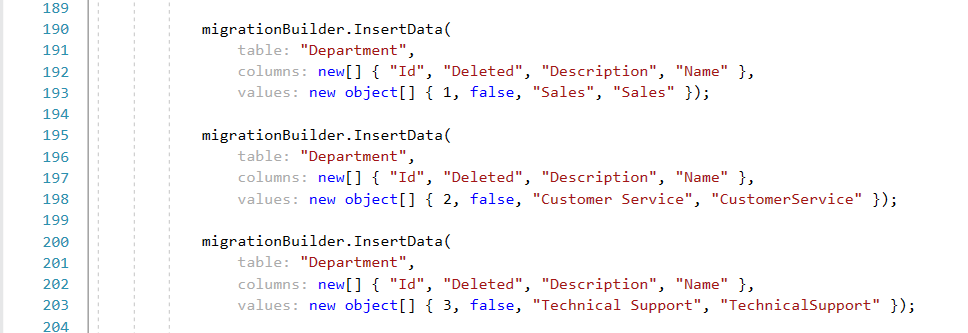
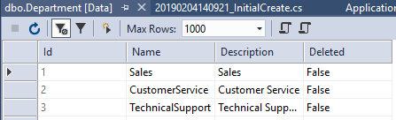

# EnumSeeder
Code first may be the best thing since sliced bread, but 
I don't care much for how it handles enums. 
Enums work just fine but if you're only looking at the 
database they don't make much sense. 

> Note: This example is in .Net Core, but should be easy to adapt
> to any other version of .Net

So an enum like the following:

```csharp
public enum Status {
    New,
    InProgress,
    OnHold
}
```

becomes 0, 1, and 2 in the database. 
Functionally this is fine, but you'll find yourself 
constantly refrencing the enum code to figure out what 
a status of 2 means in the "jobs" table.

In a more traditonal (old style) database we would have 
had a lookup table called JobStatus with Id and Name columns. 
This table could easily be joined to the jobs table 
so we could display the human readable names of 
"New", "InProgress", and "OnHold" instead of 0, 1 and 2.

You could manually create and populate the table using a 
custom migration and some insert statements, but now if the 
enum needs to change you will likely have more than one place 
to change the code.

Fortunately with just a little bit of code you can create
and populate a look up table that corresponds to the enum 
and have it work with code first migrations. 

So let's walk through it.
I have 3 projects in my example, a Web API project, a models 
project and a service project.
You can use this technique regardless of how you layout your own 
projects. This is just my standard configuration. 
I have also added swagger to my configuration to make 
it easy to test.

We'll start by creating a model and an enum in the models project.
We'll create a class called "Employee" (with an interface of IEmployee) that 
uses an enum called "Department".

```csharp
public enum Department{

    [Description("Sales")]
    Sales = 1,

    [Description("Customer Service")]
    CustomerService = 2,

    [Description("Technical Support")]
    TechnicalSupport = 3
}

public class Employee : IEmployee
{
    [Key]
    [DatabaseGenerated(DatabaseGeneratedOption.Identity)]
    [Display(Name = "Id")]
    public int Id { get; set; }

    [StringLength(512, ErrorMessage = "The first name cannot be longer than 512 characters")]
    [Display(Name = "First Name")]
    [Required]
    public string FirstName { get; set; }

    [StringLength(512, ErrorMessage = "The last name cannot be longer than 512 characters")]
    [Display(Name = "Last Name")]
    [Required]
    public string LastName { get; set; }

    public Department Department { get; set; }

}
```

You should note that we are using a description attribute and
we are explicitly setting a value for each enum.
This is important because these values will become the 
description in the lookup table and values that are more "UI friendly".

Next, in the models project we'll add a base class for all of the enums to inhereit from:

```csharp
public class EnumBase<TEnum> where TEnum : struct
{
    [Key]
    [DatabaseGenerated(DatabaseGeneratedOption.Identity)]
    public virtual int Id { get; set; }

    [Required]
    [MaxLength(100)]
    public virtual string Name { get; set; }

    [MaxLength(100)]
    public virtual string Description { get; set; }

    public virtual bool Deleted { get; set; } = false;
}
```

Finally, we'll add a class that will represent the enum 
and have it inherit from our "EnumBase" class.

```csharp
[Table("Department")]
public class DepartmentEnum : EnumBase<Department>
{
    public DepartmentEnum()
    {
    }
}
```

I have added the "Table" attribute to this class because 
the name `Department` makes more sense than a table 
called `DepartmentEnum`.

Now we need to add our DBContext. You'll notice that I'm using 
`IdentityDbContext<AppUser>` instead of plain old DbContext.
This will allow me to access the .Net Core Identity services 
at some point in the future if I need them. `AppUser` is
just a class I defined and the way I can customize an individual 
user account using the `IdentityFramerwork`. Feel free to use
plain old `DbContext` if you don't think you'll ever need
to have authenticated users. 

My AppUser class looks like this:

```csharp
public class AppUser : IdentityUser
{
    [DatabaseGenerated(DatabaseGeneratedOption.Identity)]
    public virtual int AppUser_ID { get; set; }

    [DisplayName("First Name")]
    public virtual string FirstName { get; set; }

    [DisplayName("Last Name")]
    public virtual string LastName { get; set; }

}
```

I named my DbContext class `ApplicationDbContext` it looks
like this:
```csharp
    public class ApplicationDbContext : IdentityDbContext<AppUser>
    {
        public ApplicationDbContext(DbContextOptions<ApplicationDbContext> options) : base(options){}

        public DbSet<Employee> Employees { get; set; }

        public DbSet<DepartmentEnum> Departments { get; set; }
        
        protected override void OnModelCreating(ModelBuilder modelBuilder)
        {
            //remove this line if you use plain old DbContext
            base.OnModelCreating(modelBuilder);

            //uncomment this line if you need to debug this code
            //then choose yes and create a new instance of visual
            //studio to step through the code. The debugger launches
            //wherever this line is created
            //Debugger.Launch();
        }
    }
```

Note that I've added our DbSets to our DbContext.
One for the employees and one for our DepartmentEnum.

```csharp

public DbSet<Employee> Employees { get; set; }

public DbSet<DepartmentEnum> Departments { get; set; }

```

Because we have split our services into it's own project 
we'll also need a DbContextFactory. An IDesignTimeDbContextFactory
class is necessary to get all of the migration commands
to work with a class. In a default web api setup your
models and DbContext would all be part of the same project.
That project can be launched and can contain settings with 
a connection string. The service class, however, can't
be launched and can't have its own connection string.
The IDesignTimeDbContextFactory is our work-around
for this problem. I added a class called DbContextFactory.
It inherits from IDesignTimeDbContextFactory and has
our connection string.

```csharp
public ApplicationDbContext CreateDbContext(string[] args)
{

    var builder = new DbContextOptionsBuilder<ApplicationDbContext>();
    builder.UseSqlServer(
        @"Server=(localdb)\MSSQLLocalDB;Database=EnumSeeder;Trusted_Connection=True;MultipleActiveResultSets=true");

    //get the dbContext
    var context = new ApplicationDbContext(builder.Options);

    return context;
}
```

Now it's time to add the code that brings this all together.
Because we'll be creating a generic object for each enum
we'll need a way to populate the properties of an object 
without knowing what object we're populating.

```csharp
private void TrySetProperty(object obj, string property, object value)
{
    var prop = obj.GetType().GetProperty(property, BindingFlags.Public | BindingFlags.Instance);
    if (prop != null && prop.CanWrite)
        prop.SetValue(obj, value, null);
}
```

Now we need a class that we can use to convert an individual Enum to its
values. This will help with retrieving the description.
I created a class that looks like this:

```csharp
public class EnumDescription
{
    public int Key { get; set; }
    public string Value { get; set; }
}
```

Now we need some code to allow us to extract all 3 
components (Id, Name and Description). I added this code directly to
my `ApplicationDbContext` class.


```csharp
public static KeyValuePair<string, List<EnumDescription>> ConvertEnumWithDescription<T>() where T : struct, IConvertible
{
    if (!typeof(T).IsEnum)
    {
        throw new Exception("Type given T must be an Enum");
    }

    var enumType = typeof(T).ToString().Split('.').Last();
    var type = typeof(T);

    var itemsList = Enum.GetValues(typeof(T))
        .Cast<T>()
        .Select(x => new EnumDescription
        {
            Key = Convert.ToInt32(x),
            Value = GetEnumDescription<T>(Enum.GetName(typeof(T), x))
        })
        .ToList();

    var res = new KeyValuePair<string, List<EnumDescription>>(
        enumType, itemsList);
    return res;

}

public static string GetEnumDescription<T>(string enumValue)
{
    var value = Enum.Parse(typeof(T), enumValue);
    FieldInfo fi = value.GetType().GetField(value.ToString());

    DescriptionAttribute[] attributes =
        (DescriptionAttribute[])fi.GetCustomAttributes(typeof(DescriptionAttribute), false);

    if (attributes.Length > 0)
        return attributes[0].Description;
    return value.ToString();
}
```

And finally I add the line to our DbContext that will make the seeding work.
You will need one of these lines for each enum you add to 
the project. Once this line is added however, it should never
be necessary to do anything but just change the actual enum
code.

The line is:
```csharp
//Seed Enums
SeedEnum<DepartmentEnum,Department>(modelBuilder);
```

Which comes in the form of:
```csharp
//Seed Enums
SeedEnum<ENUM_CLASS_NAME,ENUM>(modelBuilder);
```

At this point all we need to do is switch to the 
service project in the package manager console and
add our migration. 


The migration produced will include instructions to make sure our "lookup" table
gets populated with values.



Now I can call "update-database".


At this point we have the new Department table created and
its populated with the data from the enum.



Now we can write a query like this:

```sql
SELECT 
	e.FirstName, 
	e.LastName, 
	e.Department,
	d.Description as [DepartmentName] 
FROM Employees e
INNER JOIN Department d on d.Id = e.Department
```

From this point forward adding an enum with a corresponding
lookup table should be as easy as:

1. Add the Enum
2. Create the enum class which inherits from EnumBase
3. Add a "seed" line in `OnModelCreating` method of your DbContext
4. Add your migration (`add-migration`)
5. Update the databse (`update-database`)

Modifying an enum should only require making your change to
the enum and performing step 4 and 5.

Finally, It's important to note that there are other ways
to solve this problem. It really comes down to what you
find acceptable in your database.

1. [Classes with string constants](https://codereview.stackexchange.com/questions/154676/storing-enum-values-as-strings-in-db)
2. [Enum class instead of enum](https://docs.microsoft.com/en-us/dotnet/standard/microservices-architecture/microservice-ddd-cqrs-patterns/enumeration-classes-over-enum-types)
3. [.Net Core value conversions](https://docs.microsoft.com/en-us/ef/core/modeling/value-conversions)

Each of these has similar challenges with value conversions 
being prehaps the best alternative that requires little 
customization -- Provided you don't mind storing the text 
values in the database.

What else could be done? You'll probably notice that I 
also have a "Deleted" property that isn't really being handled
by migrations. So the last peice of the puzzle would be to
write a custom attribute that will allow me to flag the
property in the same way that we use the "Description"
attribute and then add code to extract that value as well.
I just ran out of time to get this last item done :)


